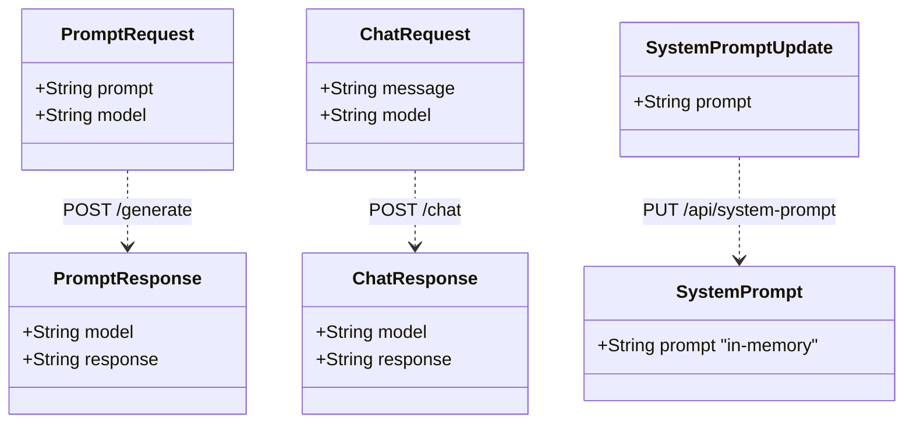

# ERD — raptor-chatbot-llm

**Date:** 2026-04-13
**Stack:** Python · FastAPI · Ollama
**Port:** 8000

---

## Schemas de request/response (runtime only — sem persistência)

---

## Endpoints expostos

| Método | Rota | Descrição |
|--------|------|-----------|
| POST | `/generate` | Geração direta de texto via Ollama |
| POST | `/chat` | Chat com histórico de contexto |
| GET | `/api/system-prompt` | Retorna o system prompt atual |
| PUT | `/api/system-prompt` | Atualiza o system prompt (in-memory) |

---

## Comunicação com Ollama (port 11434)

| Método | Rota Ollama | Uso |
|--------|-------------|-----|
| POST | `/api/generate` | Geração de texto |
| GET | `/api/tags` | Lista modelos disponíveis |
| POST | `/api/pull` | Download de modelo |

---

## Decisões de design

- **system_prompt in-memory:** não é persistido — reiniciar o container reseta para o padrão.
- **Proxy Ollama:** o serviço age como proxy/wrapper do Ollama, adicionando context management e system prompt.
