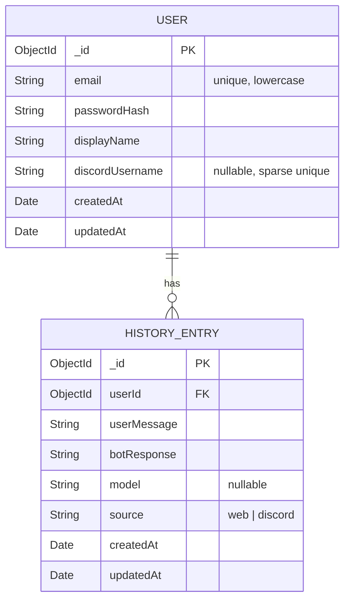

# ERD — raptor-chatbot-server

**Date:** 2026-04-13
**Stack:** Node.js · Express · MongoDB (Mongoose)
**Port:** 3001

---

## Entidades persistentes (MongoDB)

---

## Endpoints expostos

| Método | Rota | Descrição |
|--------|------|-----------|
| POST | `/auth/register` | Cadastro de usuário |
| POST | `/auth/login` | Login → retorna JWT |
| GET | `/auth/me` | Retorna usuário autenticado |
| GET | `/auth/history` | Lista histórico do usuário |
| POST | `/auth/history` | Salva entrada de histórico (web) |
| DELETE | `/auth/history` | Apaga todo o histórico do usuário |
| GET | `/auth/history/stream` | SSE — live updates de histórico |
| POST | `/discord/history` | Salva histórico via bot (usa `X-Bot-Secret`) |

---

## Decisões de design

- **discordUsername como chave de vínculo:** o bot não autentica via JWT; usa `X-Bot-Secret` + `discordUsername` no header para resolver o `userId` antes de persistir.
- **source enum:** `HistoryEntry.source` distingue entradas vindas do web (`web`) vs. bot Discord (`discord`).
- **SSE para live updates:** `GET /auth/history/stream` notifica a web em tempo real quando o bot salva um novo histórico.
