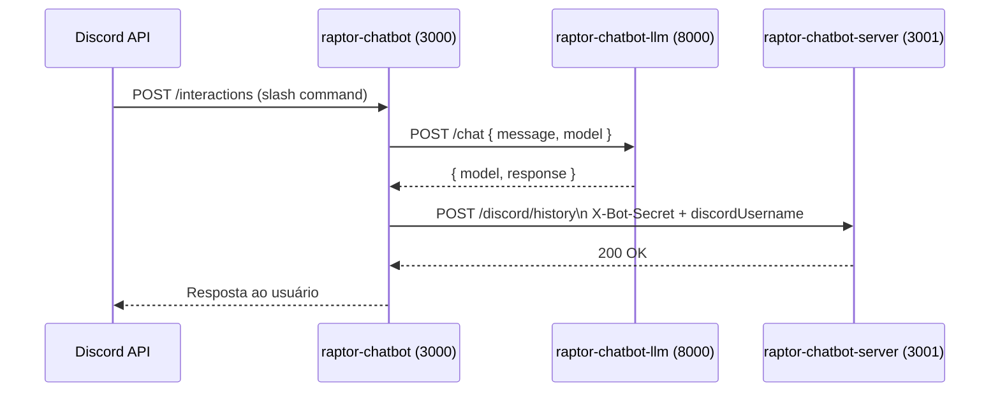

# ERD — raptor-chatbot

**Date:** 2026-04-13
**Stack:** Node.js · Express · Discord HTTP Interactions
**Port:** 3000

---

## Persistência

Nenhuma. O bot não mantém estado próprio.

---

## Fluxo de interação

---

## Endpoints expostos

| Método | Rota | Descrição |
|--------|------|-----------|
| POST | `/interactions` | Recebe eventos do Discord (slash commands, componentes) |

---

## Decisões de design

- **Stateless:** todo o estado (histórico, usuário) é delegado ao `raptor-chatbot-server`.
- **Autenticação com servidor:** usa `X-Bot-Secret` (env var) + `discordUsername` no header — sem JWT.
- **Verificação de assinatura Discord:** valida `X-Signature-Ed25519` e `X-Signature-Timestamp` em cada request.
